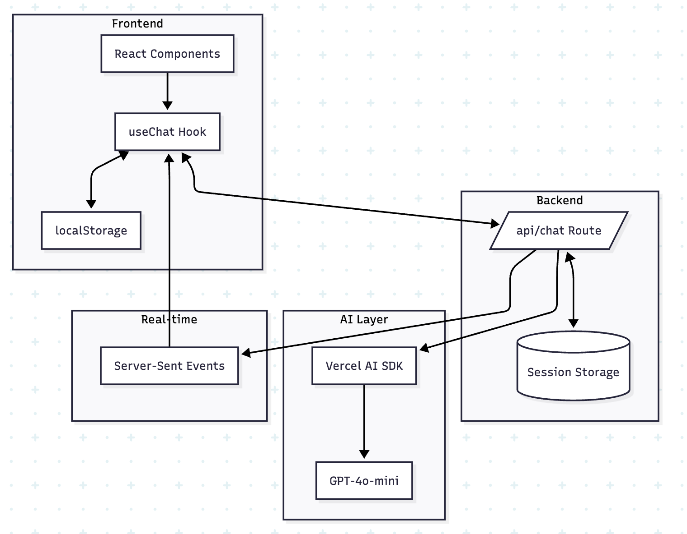

## ItemChat - Modern AI Chat Application

A production-ready AI chat application demonstrating modern web development practices with real-time streaming, persistent state management, and professional user experience.

### 🎯 Project Overview

ItemChat showcases advanced full-stack development skills through a sophisticated AI chat interface that goes beyond basic implementations:

- Real-time streaming with token-by-token AI responses
- Dual persistence strategy for reliable data management
- UX animations
- Comprehensive error handling
- Type-safe architecture with end-to-end TypeScript

### 🏗️ Architecture

### Tech Stack

#### Frontend

- Next.js 15 with App Router
- React 18 with TypeScript
- Tailwind CSS 4.0
- Framer Motion for animations
- Vercel AI SDK React hooks

#### Backend

- Next.js API Routes on Edge Runtime
- Vercel AI SDK Core for streaming
- OpenAI GPT-4o integration
- In-memory session management

### Performance Optimizations

- GPU-accelerated animations using transform/opacity
- Edge runtime for global distribution (via Vercel)

### User Experience

- Smooth message animations with stagger effects
- Visual stability during content streaming
- Responsive design across all devices

### Scalability Considerations

- Stateless API design for horizontal scaling
- Session-based storage (upgradeable to Redis/DB)
- Edge runtime deployment

### Development time

~ 4hrs
